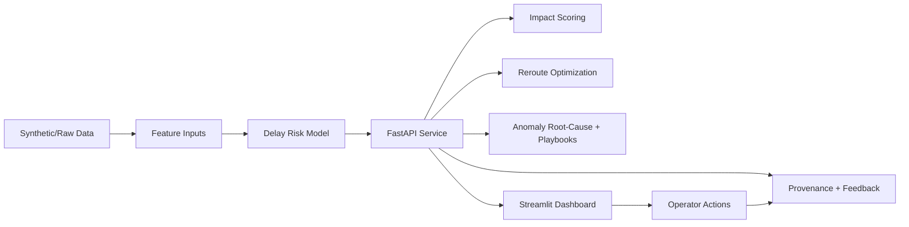

AI System for Predictive Monitoring of Supply Chain Disruptions
===============================================================

This project is a lightweight, practical disruption-monitoring system for supply chain operations.
It predicts delay risk, estimates economic impact, recommends cost-aware rerouting, analyzes anomalies with root-cause playbooks, and logs model provenance + feedback for active learning.

Why this project
----------------
Supply chains face frequent volatility from congestion, weather, and route complexity. Teams need a fast system that is easy to run and still provides actionable outputs.

This repository focuses on:

- Predictive monitoring first (simple model + fast API + operator dashboard)
- Decision support extensions (what-if simulation, reroute optimization)
- Practical governance (prediction logs, feedback capture, provenance summary)

Implemented capabilities
------------------------
All requested capabilities are implemented:

1. Prescriptive optimization
- Endpoint: `POST /optimize/reroute`
- Uses synthetic route options and expected economic impact to recommend the lowest total expected cost route.

2. Scenario what-if UI
- Dashboard tab: `Prediction & What-if`
- Compares baseline vs intervention scenario (example: reduced port wait) and shows projected savings.

3. Anomaly root-cause + playbooks
- Endpoint: `POST /analyze/anomaly`
- Computes feature z-scores vs synthetic baselines, returns top root causes and mapped playbook actions.

4. Model provenance + active learning
- Endpoints: `GET /provenance`, `POST /feedback`
- Logs predictions to JSONL, stores outcome labels, and summarizes feedback rate for retraining readiness.

5. Economic impact scoring
- Endpoint: `POST /impact`
- Returns expected delay hours, delay cost, SLA penalty, and total expected impact in USD.

Technology and models
---------------------

- Language/runtime: Python 3.10+ recommended
- Serving: FastAPI + Uvicorn
- Dashboard: Streamlit
- Data/ML: pandas, numpy, scikit-learn, xgboost (available), joblib

Current model in this repo:

- `models/delay_model.pkl` built by `src/models/train_minimal.py`
- Type: Logistic Regression (scikit-learn pipeline with scaling)
- Target: binary delay risk (`delayed`)
- Features:
  - `shipping_pressure`
  - `port_wait_time`
  - `weather_risk`
  - `distance_km`

Project structure
-----------------
```text
supply-chain-disruption-prediction/
├── api/
│   └── main.py
├── dashboard/
│   └── app.py
├── data/
│   ├── generate_synthetic_data.py
│   ├── processed/
│   │   ├── synthetic_shipments.csv            # generated
│   │   ├── synthetic_routes.csv               # generated
│   │   ├── prediction_log.jsonl               # generated at runtime
│   │   └── feedback_labels.csv                # generated at runtime
│   └── raw/
├── models/
│   └── delay_model.pkl                        # generated by training script
├── src/
│   └── models/
│       └── train_minimal.py
├── notebooks/
│   └── exploratory_analysis.ipynb
├── docs/
│   └── architecture.md
├── requirements.txt
└── README.md
```

Quick start
-----------
1. Create and activate a virtual environment.

2. Install dependencies.

3. Generate synthetic data.

4. Train baseline model.

5. Start API.

6. Start dashboard.

```powershell
python -m venv .venv
.venv\Scripts\activate
pip install -r requirements.txt

python data/generate_synthetic_data.py
python src/models/train_minimal.py

uvicorn api.main:app --reload --host 0.0.0.0 --port 8000
streamlit run dashboard/app.py
```

API endpoints
-------------

- `GET /` : service metadata
- `GET /health` : readiness checks (model + synthetic files)
- `POST /predict` : delay probability and risk level
- `POST /impact` : probability + economic impact scoring
- `POST /optimize/reroute` : cost-aware route recommendation
- `POST /analyze/anomaly` : anomaly score, root causes, playbook actions
- `POST /feedback` : capture actual outcomes for active learning
- `GET /provenance` : model metadata + prediction/feedback summary

Example request payloads
------------------------

`POST /predict`
```json
{
  "shipping_pressure": 2.4,
  "port_wait_time": 10.0,
  "weather_risk": 1,
  "distance": 1800.0
}
```

`POST /impact`
```json
{
  "shipping_pressure": 2.4,
  "port_wait_time": 10.0,
  "weather_risk": 1,
  "distance": 1800.0,
  "cost_per_delay_hour_usd": 80.0,
  "sla_penalty_usd": 800.0
}
```

`POST /optimize/reroute`
```json
{
  "origin": "Los Angeles",
  "destination": "Chicago",
  "shipping_pressure": 2.4,
  "port_wait_time": 10.0,
  "weather_risk": 1,
  "distance": 1800.0,
  "cost_per_delay_hour_usd": 80.0,
  "sla_penalty_usd": 800.0,
  "budget_usd": 9000.0
}
```

High-level design
-----------------


How this differs from larger "agentic" systems
------------------------------------------------

- This project is intentionally lightweight and operator-focused.
- It prioritizes low-friction deployment and explainable outputs over a heavy research/MLOps stack.
- Advanced modules are implemented in practical form (impact, optimization, anomaly playbooks, provenance) without requiring distributed training infrastructure.

Roadmap
-------

- Add richer multi-model support (`delay_hours`, forecasting, anomaly ensembles)
- Add batch prediction endpoint and scheduler jobs
- Add model retraining pipeline that consumes `feedback_labels.csv`
- Add auth + deployment hardening for production
